# M2-MFP：面向可靠云基础设施的多尺度、多层级内存故障预测框架

Hongyi Xie、Min Zhou、Qiao Yu、Jialiang Yu、Zhenli Sheng、Hong Xie、Defu Lian

## 摘要

随着云服务日益成为现代 IT 基础设施的关键组成部分，保障硬件可靠性对于持续提供高质量服务至关重要。内存故障会严重威胁系统整体稳定性，因此必须通过分析内存错误日志（即可纠正错误，Correctable Errors，CEs）来进行准确的故障预测。现有内存故障预测方法存在明显局限：基于规则的专家模型泛化能力有限且召回率偏低，而自动特征提取方法的性能仍不理想。为解决这些问题，本文提出 M2-MFP：一种多尺度、多层级内存故障预测框架，用于提升云基础设施的可靠性和可用性。M2-MFP 将可纠正错误转换为多层级二值矩阵表示，并引入二值空间特征提取器（Binary Spatial Feature Extractor，BSFE），在 DIMM 级和 bit 级自动提取高阶特征。基于 BSFE 的输出，我们进一步设计了双路径时序建模架构：1. 时间片模块，用于聚合观测窗口内的多层级特征；2. 时间点模块，使用在 bit 级模式上训练得到的可解释规则生成树。基准数据集和真实部署环境上的实验表明，M2-MFP 显著优于现有最先进方法。代码和数据位于：https://github.com/hwcloud-RAS/M2-MFP。

## CCS 概念

- Computer systems organization -> Reliability
- Hardware -> Failure prediction

## 关键词

内存故障预测；事件序列；AIOps；可靠云基础设施

## ACM 引用格式

Hongyi Xie, Min Zhou, Qiao Yu, Jialiang Yu, Zhenli Sheng, Hong Xie, and Defu Lian. 2025. M2-MFP: A Multi-Scale and Multi-Level Memory Failure Prediction Framework for Reliable Cloud Infrastructure. In Proceedings of the 31st ACM SIGKDD Conference on Knowledge Discovery and Data Mining V.2 (KDD '25), August 3-7, 2025, Toronto, ON, Canada. ACM, New York, NY, USA, 12 pages. https://doi.org/10.1145/3711896.3737243

KDD 可用性链接：本文源代码已公开发布于 https://doi.org/10.5281/zenodo.15515907。

## 1 引言

现代云基础设施高度依赖硬件组件的持续可靠性，以提供不中断的服务。随着数据中心为满足不断增长的计算需求而呈指数级扩张，内存故障已成为系统整体稳定性的主要威胁之一 [16, 27, 30, 32, 33, 41]。与瞬时软件问题不同，内存故障通常表现为错误的渐进式累积，而现有纠错机制无法完全解决这类问题。对可纠正错误（CEs）的分析表明，其时空模式包含关键故障的重要先兆；然而，当前云系统主要采用被动维护策略 [6, 21, 24, 28, 39]。这一差距凸显了主动预测框架的迫切需求，以补充现有错误纠正能力。

内存故障预测旨在通过分析内存错误日志中的时间和空间模式，识别即将发生的硬件故障。该任务需要对 CE 序列建模；CE 是由错误检查机制检测并纠正的异常，用于在关键故障发生之前做出预测。主要挑战来自三个固有复杂性：1. 真实错误日志中的运行噪声和数据缺失；2. 正常运行样本与罕见故障事件之间极端的类别不平衡；3. 不同厂商和架构之间异构的硬件配置。这些因素要求模型能够从稀疏、嘈杂且高度可变的数据源中学习鲁棒表示。

传统方法在应对这些挑战时存在显著局限。基于规则的专家系统 [9, 11, 38] 难以适应多样化硬件配置和不断演化的故障模式，并且需要大量专家参与。自动机器学习方法通常依赖人工设计特征，无法捕捉错误发生位置之间的空间关联 [4, 10]。现有深度学习模型往往将错误日志视为连续事件，而没有考虑内存架构的层级特性，导致特征表示欠佳 [24]。这些方法在不同内存类型和厂商之间泛化较差，限制了其在异构云环境中的实际部署。

尽管云服务提供商和设备厂商已经广泛研究内存故障预测，但由于隐私问题，包含错误日志中物理信息（内存单元地址）和逻辑信息（数据访问过程中的错误 bit）的、大规模数据集一直难以公开。为推动该领域研究，我们从华为云运行中的数据中心构建了一个基准数据集。该数据集包含超过 70,000 个出现 CE 的内存模块，其中超过 1,700 个发生过故障；数据来自数百万台服务器，覆盖九个月时间，并跨越多种 CPU 架构。除丰富的错误日志信息外，该数据集还完整体现了真实世界中的数据不完整、显著噪声、类别不平衡以及厂商差异等挑战。

本文进一步提出多尺度、多层级内存故障预测框架 M2-MFP。该框架引入新的多层级二值空间特征提取器（Multi-BSFE），从 CE 中提取潜在故障特征表示。随后，M2-MFP 集成双路径时序建模架构，包括用于捕捉时间窗口内局部事件模式的时间片尺度预测模块，以及用于识别特定时间点关键致故障事件的时间点尺度预测模块。该双通道预测器既适用于批量事件序列数据，也适用于流式事件序列数据。与现有方案相比，M2-MFP 具有更强的智能性、自动化能力和泛化能力，仅需少量专家知识，同时在性能上显著超过基线方法。

M2-MFP 已正式部署在华为云 AIOps 平台上，持续支撑超过 400,000 台服务器的可靠运维。我们的算法在华为云灰度环境中连续三个月表现优异，使 F1-score 提升约 15%。

本文主要贡献如下：

- 公开发布首个包含多层级 CE 信息的大规模内存日志数据集，覆盖多种厂商和架构，从而促进该领域的广泛研究与进展。
- 提出 M2-MFP，一种通用的层级式故障预测框架，有望提供通用、可扩展、可伸缩的硬件故障预测能力。
- 将 M2-MFP 部署到真实生产环境中，为数百万台设备提供实时监控服务，提升云服务的可靠性和可用性，并节省停机成本。

## 2 背景、数据集与任务

### 2.1 内存故障预测系统

内存故障预测系统基于云服务的历史运行日志预测未来故障，图 1 展示了其工作流。系统依赖来自基板管理控制器（Baseboard Management Controller，BMC）的数据。BMC 是嵌入服务器主板的专用微控制器，用于监控和管理云服务中的硬件、软件和网络组件。对于内存故障预测，BMC 跟踪内存运行状态，并将静态配置信息（如内存类型、容量、厂商）以及实时事件日志传输到智能运维（Artificial Intelligence for IT Operations，AIOps）系统。

系统会周期性地使用离线收集的历史日志训练故障预测模型并上线部署，例如在我们的部署中每三个月训练一次。上线后的模型会按照固定间隔（如每 15 分钟）分析滑动时间窗口内的事件日志并执行故障预测。当预测结果表明可能出现故障时，系统触发告警，通知架构师和硬件工程师进行诊断分析和纠正操作。

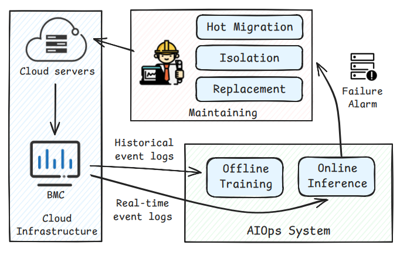

图 2 展示了云服务器内存系统的层级组织结构，涵盖服务器级信息（图 2A）、DIMM 级信息（图 2B）和 bit 级信息（图 2C）。每台服务器集成多个 CPU，服务器级元数据记录 CPU 配置及相关双列直插式内存模块（Dual Inline Memory Module，DIMM）。从基本结构看，一个 DIMM 包含多个 DRAM 芯片（device），这些芯片被组织为 rank，以支持同一 rank 内的并行读写操作。本文中 “DRAM chip” 与 “device” 两个术语交替使用。

每个 device 包含多个并行工作的 bank，bank 又进一步划分为行和列。行列交叉处形成一个 cell，用于存储单个数据 bit。集成内存控制器（Integrated Memory Controller，IMC）负责在 DIMM rank 与 CPU 之间进行通信。对于 x4 DDR4 芯片，每条访问周期中 4 条 DQ 信号线各传输 8 个 beat，因此每次传输共有 32 bit 数据，我们将其表示为一个 8 x 4 的 DQ-Beat 矩阵。每个 rank 包含一个 ECC 芯片，通过 ECC 编码进行错误检测和纠正 [1, 21]。内存日志会记录可纠正错误以支持预测性维护，而灾难性故障主要源于不可纠正的传输错误。

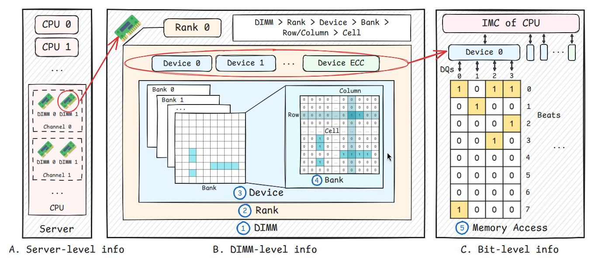

### 2.2 数据描述

我们的数据集由华为云生产环境中超过 70,000 个 DIMM 的日志组成，采集时间为 2024 年 1 月至 9 月。数据包括两类：CE 日志和故障 DIMM 的故障记录。下面给出一个 CE 日志示例。需要注意的是，厂商、区域等敏感信息已经根据华为云保密策略进行匿名化处理，细节见附录 A。

```text
DIMM d 中的 CE e:
['CpuId': 0, 'ChannelId': 1, 'DimmId': 0, 'RankId': 1,
 'ChipId': 1, 'BankId': 2, 'RowId': 67745, 'ColumnId': 0,
 'MemoryType': 'DDR4', 'Manufacturer': 'A', 'Region': 'E',
 'Capacity': 16, 'ProcessorArchitecture': 'X86 Intel Purley',
 'MaxSpeedMHz': 4000, 'FrequencyMHz': 2600,
 'LogTime': 1711522709,
 'beats': '0': [], '1': [], '2': [], '3': [],
          '4': [], '5': [], '6': [57], '7': []]
```

对于一个 DIMM `d`，记 `E_d` 为 `d` 的全部 CE 记录集合。每个 CE `e`（其中 `e in E_d`）包含错误类型（Read CE 或 Scrub CE）、日志时间戳，以及按照三个层级组织的空间信息：

- 服务器级：`d` 的静态配置参数，包括 CPU 型号、最高频率、基准频率等服务器属性，以及 DIMM 型号、容量、厂商规格等 DIMM 特定属性。
- DIMM 级：故障内存单元的标识，使用 rank ID、device ID、bank ID、row ID、column ID 等层级坐标记录故障位置。
- bit 级：内存访问过程中的错误 bit，被捕捉为 32 bit 二进制序列，表示 x4 DDR4 芯片中 DQ-Beat 矩阵上的错误状态。

### 2.3 内存故障预测任务

基于事件序列的内存故障预测可以形式化为机器学习中的二分类任务。其目标是根据历史事件信息，预测未来指定预测窗口内是否会发生故障，如图 3 所示。预测过程包含一个提前窗口（lead window），这是考虑真实运行约束的关键缓冲期，包括数据传输延迟、模型推理延迟，以及工程师缓解潜在故障所需的响应时间。

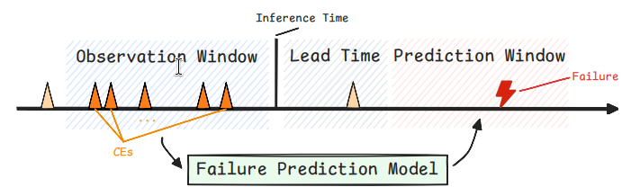

问题定义：给定 DIMM `d` 及其历史 CE 事件 `E_d`（注意多个 CE 可能同时发生），任务是在任意观测时间 `t` 动态预测 `d` 是否会在未来预测窗口 `[t + Δt_lead, t + Δt_lead + Δt_valid]` 内发生故障。这里 `Δt_lead` 表示提前时间，即预测到故障后用于采取预防措施的预留时间；`Δt_valid` 定义预测有效窗口。预测使用 `E_d` 中所有发生在 `t` 之前的 CE，二值目标标签 `y_d(t)` 定义为：若 `d` 在该区间内发生故障，则 `y_d(t)=1`，否则 `y_d(t)=0`。

## 3 相关工作

### 3.1 传统方法

传统内存故障预测方法主要依赖专家经验或统计分析，提取与故障模式相关的特征。Schroeder 等 [28] 研究了静态 DRAM 属性与故障之间的相关性，随后一系列工作 [2, 5, 9, 11, 16, 18, 19, 22, 26, 29, 30] 又考虑了更多 DIMM 级 CE 特征。基于对内存机制的分析，Giurgiu 等 [13] 提出了第一个使用 CE 进行内存故障预测的模型；Boixaderas 等 [4] 则使用 CE 计数特征构建机器学习模型。其他工作 [3, 5, 36] 总结了 CE 的 DIMM 级空间特征，并结合统计方法构造特征和训练机器学习模型；也有工作 [9, 11] 探索更全面的 DIMM 级 CE 特征以建立基于规则的模型。

然而，这些方法局限于 DIMM 级 CE 特征。Li 等 [21] 基于 bit 级信息提出 Risky CE 模式，强调了内存访问过程在内存故障预测中的重要性。Yu 等 [37, 38, 40] 进一步扩展该工作，设计了更多与内存访问相关的特征，并在 Himfp 模型 [39] 中整合 DIMM 级和 bit 级 CE 特征。不过，这些方法需要大量专家干预，或强依赖特定数据集，可能削弱其泛化能力。

### 3.2 深度学习方法

考虑到 CE 的空间特征可以被视为多层级图像，卷积神经网络（CNN）[20]、视觉 Transformer（ViT）[8] 等基于深度学习的图像处理方法可用于从 CE 中提取故障表示，并训练故障预测模型。STIM [24] 使用 Transformer [31] 有效学习 bit 级 CE 特征的隐藏变化。然而，该方法不适合处理 DIMM 级 CE 的稀疏空间信息，也无法准确捕捉与内存故障相关的特征，导致较高的误报率。

此外，一些面向硬盘驱动器的深度学习故障预测方法 [15, 35] 不适合非等间隔事件序列，而通用事件序列故障预测框架 [7, 12, 14, 23, 25, 34] 难以挖掘内存故障日志中的空间信息；不过，这些方法仍提供了有价值的启发。

## 4 方法

内存故障预测方法通常包含两个阶段：样本生成和分类器训练。第一阶段从原始 CE 事件序列中提取 DIMM 级和 bit 级信息生成样本。第二阶段在处理后的样本上训练分类器；若某个样本位于预定义未来时间段内故障发生之前，则标记为正样本，否则为负样本。

根据用于构造样本的 CE 的时间特性，方法可分为两类：时间片方法，即在滑动时间窗口内聚合多个 CE；时间点方法，即使用单个 CE 事件生成样本。

为有效捕捉 CE 的空间特性，我们提出一种多层级矩阵表示，其层级结构和维度组织如表 1 所示。该方法系统地组织不同抽象层级上的故障信息。层级结构中的每一层都以特定矩阵格式封装故障模式，并保留与下级层级之间的显式包含关系，从而同时保留错误事件的细粒度细节和高层空间相关性。

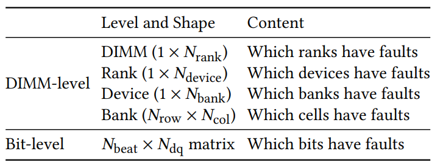

### 4.1 M2-MFP 框架

M2-MFP 框架提出了一种新的双路径架构，将多尺度时序分析与多层级特征表示结合起来，如图 4 所示。该框架首先使用二值空间特征提取器（BSFE），从 CE 的空间信息中捕捉包含潜在故障表示的高阶特征，详见 4.2 节。

在训练阶段，对于时间片尺度数据，我们使用滑动窗口聚合历史 CE，然后通过时间片尺度预测模块应用多个层级的 BSFE，以获得多层级空间特征，详见 4.3 节。对于时间点尺度数据，我们使用时间点尺度预测模块：BSFE 首先从训练集中每个 DIMM 的全部 CE 数据中提取 bit 级高阶特征，随后训练一个定制决策树，生成用于故障预测的规则集，详见 4.4 节。

在推理阶段，CE 数据分别以批处理方式进入时间片尺度预测模块，并以流式方式进入时间点尺度预测模块。最终故障预测结果由两个模块的输出合并得到。

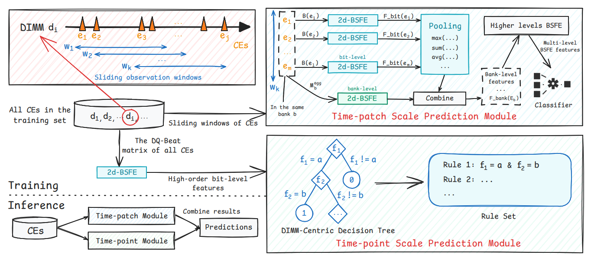

### 4.2 二值空间特征提取器（BSFE）

本文提出一种新的二值空间特征提取器（BSFE），用于从 CE 中提取空间信息。CE 日志天然包含 DIMM 级和 bit 级空间信息，这两类信息都可以用二值矩阵（0-1 矩阵）有效表示。为系统性捕捉该空间信息，我们设计了 BSFE，它包含一维 BSFE（1d-BSFE）和二维 BSFE（2d-BSFE）两个组件，如图 5 所示。BSFE 通过自定义函数和池化操作，从二值矩阵中提取有意义的空间特征。BSFE 的设计遵循以下原则：

- 对称性：考虑到 CE 日志的空间分布具有对称性，我们确保一维矩阵的翻转不会影响 1d-BSFE 的结果。
- 通用性：BSFE 适用于不同维度和尺度的二值矩阵。它可用于不同粒度层级，包括一维中的 rank 级和 device 级，以及二维中的 bank 级和 bit 级，从而适应多样化空间尺度。
- 敏感性：考虑到单个 bit 翻转就可能影响 ECC 算法结果，我们确保二值矩阵中的小扰动会体现在 BSFE 的输出中。

给定二值矩阵 `X in {0,1}^{m x n}`，我们在设计 BSFE 特征时综合考虑对称性、通用性和敏感性。具体而言，我们处理矩阵的每一行或每一列，以提取能够有效刻画元素密度、分散程度、聚集程度和覆盖范围的空间特征，帮助区分内存故障预测中的故障分布模式。形式化地，对于一维二值矩阵：

```text
X_1d := [x_1, ..., x_n], 其中 x_i in {0,1}.        (1)
```

所提取特征计算为：

```text
BSFE_1d(X_1d) = (phi_1(X_1d), ..., phi_f(X_1d)),   (2)
```

其中 `f` 表示提取的特征数量，`phi_l(X_1d) in R` 表示一个特征描述子。下面以五种空间描述子为例：元素计数、组计数、最长连续计数、最大距离和最小距离。

```text
(element)  phi_1(X_1d) = sum_{i=1}^{n} x_i,                                      (3)
(group)    phi_2(X_1d) = sum_{i=1}^{n-1} I(x_i=0 and x_{i+1}=1) + I(x_1=1),       (4)
(max-csc)  phi_3(X_1d) = max_{1<=i<=j<=n}(j-i+1) prod_{k=i}^{j} x_k,             (5)
(max-dist) phi_4(X_1d) = max_{1<=i<j<=n, x_i=x_j=1} |j-i|,                       (6)
(min-dist) phi_5(X_1d) = min_{1<=i<j<=n, x_i=x_j=1} |j-i|,                       (7)
```

其中 `I(.)` 表示指示函数。

在 1d-BSFE 基础上，我们将方法扩展到二维矩阵，以捕捉 bank 和错误 bit 上的空间依赖。2d-BSFE 包含两个模块：先降维后聚合（Reduction-then-Aggregation）和先聚合后降维（Aggregation-then-Reduction）。

- 先降维后聚合：首先按行应用 1d-BSFE，得到中间表示：

```text
G_r(X) = BSFE_1d^row-wise(X),  G_r(X) in R^{m x f}.                              (8)
```

随后在 `G_r(X)` 上按列执行多种池化操作，池化核形状为 `m x 1`。假设使用 `k` 种池化方法（如最大池化、平均池化等），则聚合表示为：

```text
G_rp(X) = Pool_{m x 1}^col-wise(G_r(X)),  G_rp(X) in R^{k x f}.                  (9)
```

- 先聚合后降维：首先对输入 `X` 按列执行最大池化，池化核形状为 `m x 1`，得到：

```text
G_p(X) = MaxPool_{m x 1}^col-wise(X),  G_p(X) in R^{1 x n}.                     (10)
```

随后对最大池化后的矩阵按行应用 1d-BSFE：

```text
G_pr(X) = BSFE_1d^row-wise(G_p(X)),  G_pr(X) in R^{1 x f}.                      (11)
```

将 `G_rp(X)` 和 `G_pr(X)` 向量化并拼接，即得到行级 2d-BSFE 的最终表示：

```text
BSFE_2d(X)_row-level = [Vec(G_rp(X)), Vec(G_pr(X))].                            (12)
```

将上述过程中的按行和按列操作互换，可得到列级 2d-BSFE。最终，整体 2d-BSFE 由行级和列级结果合并得到：

```text
BSFE_2d(X) = [BSFE_2d(X)_row-level, BSFE_2d(X)_column-level].                   (13)
```

BSFE 对发现传统基于规则方法常常忽略的细微模式至关重要，并为内存故障分析和预测提供了坚实基础，从而提升框架整体预测能力。

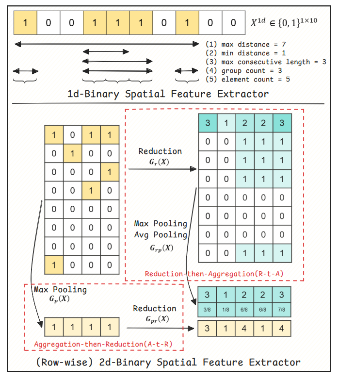

### 4.3 时间片尺度预测模块

对于时间片尺度，我们设计了名为 Multi-BSFE 的多层级特征提取器，它通过 BSFE 将层级式特征提取与多尺度聚合结合起来。给定时间片内的 CE 事件集合 `E`，每个事件 `e in E` 首先在 bit 级被分析。记 `B(e) in {0,1}^{N_beat x N_dq}` 为 `e` 的二值 DQ-Beat 矩阵。bit 级特征提取为：

```text
F_bit(e) = BSFE_2d(B(e)).                                                       (14)
```

在 bank 级，事件按照其 bank 位置分组。对索引为 `b` 的 bank，记 `E_b` 为 `E` 中所有 `Bank_id` 等于 `b` 的 CE 集合。每个 CE 记录一个 bank 上故障 cell 的位置。该位置表示为二值矩阵 `M_b in {0,1}^{N_row x N_col}`，其中恰有一个元素为 1，其行列索引表示故障 cell 的位置。聚合 bank 矩阵 `M_b^agg` 可通过逐元素最大化构造：

```text
M_b^agg(r,c) = max_{e in E_b} M_b(e)(r,c),
forall r in {1,...,N_row}, c in {1,...,N_col}.                                  (15)
```

随后，将 `M_b` 的 BSFE 与池化后的高阶 bit 级特征（不同池化方法）结合，得到 bank 级特征：

```text
F_bank(E_b) = [Vec(BSFE_2d(M_b^agg)), Vec(Pool({F_bit(e)}_{e in E_b}))].          (16)
```

该层级过程可扩展到整个内存组织层级。对于任意相邻的两个层级，较低层级 `L` 和较高层级 `H`（例如 bit-level < Bank < Device < Rank < DIMM），Multi-BSFE 应用为：

```text
F_H(E) = [Vec(BSFE_2d(M_H^agg)), Vec(Pool({F_L(e)}_{e in E}))],                  (17)
```

其中 `M_H^agg` 是层级 `H` 上的聚合矩阵。

实践中，由于超过 90% 的 DIMM 在一个时间片内仅表现出单个错误 Device、Rank 或 DIMM，我们省略这些低维层级上的池化，仅在 DIMM 级应用池化。我们还保留传统计数特征 [21, 39]，包括：

- 时间片内的 CE 计数；
- 存在 DQ 错误的事件数量，记为 `theta_DQ`；
- 存在 Beat 错误的事件数量，记为 `theta_Beat`；
- CE 频率，即单位时间内的 CE 事件数。

最终时间片特征向量由 Multi-BSFE 的输出与派生计数特征拼接而成。这些生成特征随后输入分类器，例如 LightGBM [17]，以训练故障预测模型。在训练和推理期间，系统以 `Delta_i_p` 的固定间隔，使用前一观测窗口内的 CE 日志生成特征，从而保证预测的时间一致性。

### 4.4 时间点尺度预测模块

我们基于 bit 空间特征和 `CE_type` 设计了一个定制 Gini 决策树，用于实现时间点粒度的故障预测。关键创新在于使用以 DIMM 为中心的 Gini 增益，而非样本级不纯度指标。算法如下：

```text
算法 1 以 DIMM 为中心的决策树

输入：包含 DIMM ID 和特征 F 的训练数据 D
输出：用于时间点预测的决策树

1: DIMM Gini:
   G(D) = 1 - (|D+| / |D|)^2 - (|D-| / |D|)^2
   其中 D 为 DIMM 集合，D+/D- 分别为故障/正常 DIMM
2: procedure BuildTree(D, F)
3:   D <- D 中唯一 DIMM，D+ <- 故障 DIMM
4:   if (|D+|/|D-| > theta 或 |D-|/|D+| > theta)
        或（达到最大深度 或 |D| <= 1）then
5:       return Leaf: I(|D+| >= |D-|)
6:   end if
7:   寻找最优划分 (f*, v*) 以最小化：
       min_{f,v} [ |D_L|/|D| G(D_L) + |D_R|/|D| G(D_R) ]
8:   其中 D_L = {d in D | 存在 x in d: x_f = v}, D_R = D \ D_L
9:   if 不存在有效划分 then return Leaf
10:  end if
11:  将 D 划分为 D_L（DIMM 属于 D_L）和 D_R
12:  return Node(f*, v*, BuildTree(D_L), BuildTree(D_R))
13: end procedure
```

我们将以 DIMM 为中心的决策树中所有输出为 1（表示故障）的分支提取到规则库中。推理期间，来自数据流的每条新 CE 数据记录都会与规则库匹配；若某条记录匹配任意规则，则预测对应 DIMM 将在未来发生故障。

## 5 实验

### 5.1 实验设置

数据集。内存故障预测数据集包含 9 个月的内存日志。前 5 个月作为训练集，后 4 个月作为测试集。由于 bit 级特征可以表示为 8 x 4 矩阵，除现有内存故障预测方法外，我们还比较了若干图像分类方法。为保证公平评估，所有算法均在我们的数据集上复现。代码已公开：https://github.com/hwcloud-RAS/M2-MFP。

基线方法。对于时间点方法，由于单个 CE 样本中的 DIMM 级信息不足以进行故障预测，因此仅使用 bit 级特征。Naive 方法比较正负样本中的 bit 级特征频率，当正样本频率更高时预测为故障。Risky CE [21] 在低位 DQ（位置 0 和 1）与高位 DQ（位置 2 和 3）同时出现故障时预测为故障。DQ Beat Predictor [39] 在故障 DQ 和故障 Beat 均超过 1 个时推断为故障。CNN [20] 将 bit 级特征表示为 8 x 4 矩阵，并采用图像分类方法。我们的时间点模块使用最大深度为 4 的定制决策树训练。

在时间片方法中，样本由按小时聚合、对全部 bit 级特征求和的数据生成。CNN 使用 3 x 3 卷积核；CNN（1D kernel）使用 1 x 4 和 8 x 1 卷积核并配合最大池化。ViT [8] 将 8 x 4 矩阵划分为 32 个大小为 1 x 1 的 patch；ViT（1D patch）使用 1 x 4 和 8 x 1 patch。STIM [24] 聚合连续 6 小时的特征，并使用 Transformer 编码器处理。所有方法都将编码后的 bit 级特征与 CE 计数特征拼接，并训练 MLP 分类器。Himfp [39] 集成 DIMM 级和 bit 级的计数与模式特征；为保证可复现性，我们仅使用论文中描述的公开特征。Himfp 和我们的时间片模块都使用三个观测窗口（15 分钟、1 小时和 6 小时）生成高层特征。

所有深度学习方法使用 batch size 256、Adam 优化器（学习率 0.001）训练 1000 个 epoch，并使用 early stopping（patience 为 3）。除基于规则的模型外，所有模型都使用交叉熵作为损失函数。更多细节见附录 B。

评估指标。令 `t` 为预测时间戳，并定义预测窗口：

```text
T_pred(t) = [t + Delta_t_lead, t + Delta_t_lead + Delta_t_valid],
```

其中 `Delta_t_lead = 15` 分钟（最小提前时间），`Delta_t_valid = 7` 天（预测跨度）。记 `F` 为测试期间发生故障的 DIMM 集合，记 `t_f^s` 为 DIMM `s` 的故障时间。若对 DIMM `s` 在时间 `t` 的预测满足 `s in F` 且 `t_f^s in T_pred(t)`，则该预测被认为正确。定义既发生故障又被成功预测的 DIMM 集合：

```text
S = {s in F : exists t, y_pred,s(t)=1 and t_f^s in T_pred(t)}.                  (18)
```

则评估指标计算如下：

```text
P = |S| / |{s : exists t, y_pred,s(t)=1}|,
R = |S| / |F|,
F1 = 2 x P x R / (P + R).                                                       (19)
```

评估细节见附录 C。

### 5.2 性能比较

为公平比较，我们基于各基线方法的最佳 F1-score 进行评估。同时，Time-point-ours（M2-MFP 中的时间点模块）、Time-patch-ours（M2-MFP 中的时间片模块）和 Combined-ours（M2-MFP）使用通过 5 折交叉验证优化得到的阈值。表 2 显示，我们的时间点模块和时间片模块均优于各自类别中的其他方法；进一步组合后的 M2-MFP 框架继续提升性能，相比最优基线方法实现约 55% 的相对 F1-score 提升。

结果表明，Risky CE、DQ Beat 等基于规则的方法存在误报方面的局限；而经过适配的 CNN（1D kernel）和 ViT（2D patch）变体优于标准版本，凸显了 CE 特定时序特征的重要性。更关键的是，2D-BSFE 从 bit 级信息中提取 CE 模式，并具备三方面优势：对称性（相对于 naive 方法）、通用性（相对于 DQ-Beat/Himfp）和敏感性（相对于 CNN/ViT/STIM）。通过将这些优势整合到 M2-MFP 的多尺度层级结构中，我们实现了最先进的预测性能。

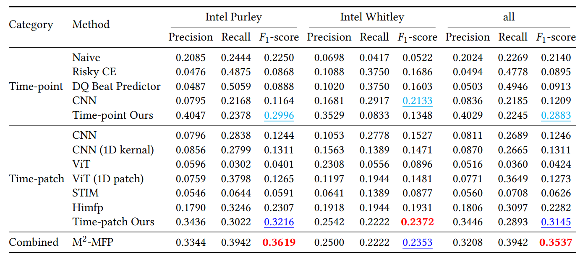

### 5.3 消融实验

#### 5.3.1 时间片模块消融

我们首先分析时间片模块中使用 multi-BSFE 特征的 LightGBM 分类器的特征重要性。图 6 所示的特征重要性评估揭示了关键模式。可以看到，在时间片模块中，multi-BSFE 提取的 DIMM 级特征（蓝色柱）和 bit 级特征（绿色柱）都非常重要。此外，经由先降维后聚合路径（用左斜线 “/” 标记）和先聚合后降维路径（用右斜线 “\” 标记）得到的特征，也是模型性能的重要贡献因素。

我们进一步比较五种配置进行消融研究：1. 去除先降维后聚合路径；2. 去除先聚合后降维路径；3. 仅使用 DIMM 级特征；4. 仅使用 bit 级特征；5. 完整方法。实验结果（表 3）证明了双路径特征提取和多层级特征集成的必要性。

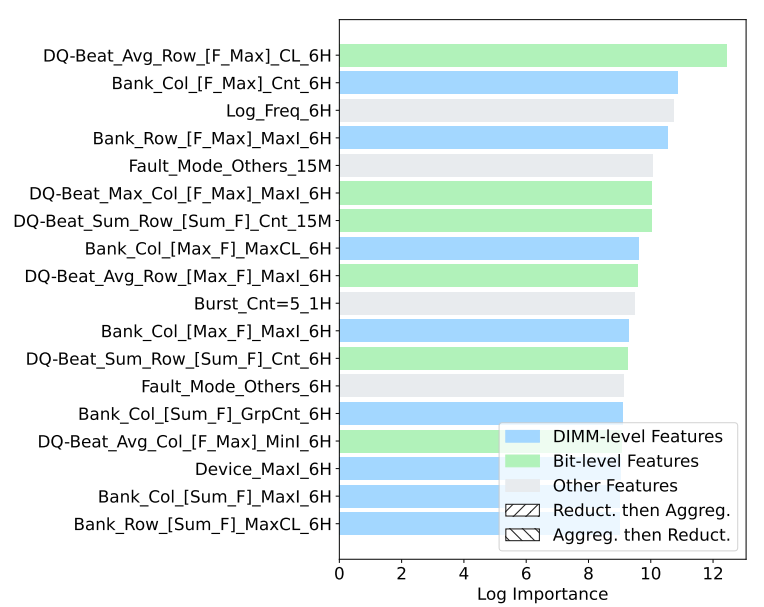

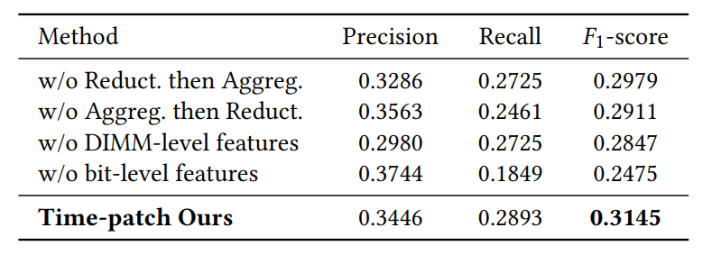

#### 5.3.2 时间点模块消融

对于时间点模块消融实验，我们保持相同模型输入，同时将我们设计的时间点模块替换为若干替代方法：LightGBM、XGBoost、FTTransformer 和 Gini 决策树。实验结果（表 4）清楚表明，与这些替代方法相比，我们提出的时间点模块取得了最佳性能。

时间点模块从 2d-BSFE 学到并识别为故障模式的一条规则为 `A & B & C`，其中 A 和 B 是先聚合后降维条件，C 是先降维后聚合条件，如图 7 所示。

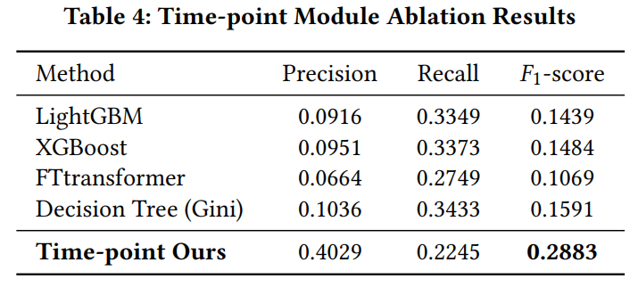

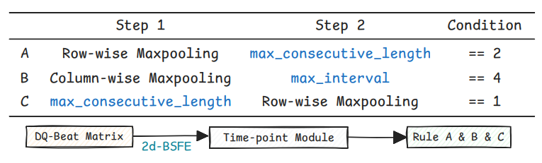

### 5.4 提前时间分析

在实际应用中，由于数据传输延迟以及故障处理（如故障隔离或热迁移）所需时间，预测算法必须提前预判故障。我们通过将 `Delta_t_lead` 从 1 秒变化到 60 分钟，分析提前时间的影响。M2-MFP 及其变体的性能如图 8 所示。分析表明，随着 `Delta_t_lead` 增大，被召回的故障 DIMM 数量减少。然而，在所有 `Delta_t_lead` 设置下，多尺度 MFP 的两个模块仍然互补；组合使用它们能够有效提升故障召回率和 F1-score。

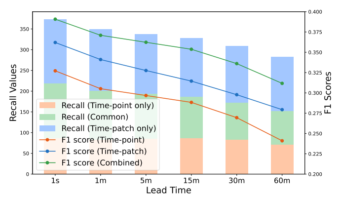

## 6 部署

### 6.1 部署细节

华为云内存故障预测系统遵循类似图 1 的工作流，包含四个关键阶段。首先，服务器硬件通过嵌入式传感器和内存控制器生成原始错误信号。随后，这些信号由基板管理控制器（BMC）处理；BMC 实时监控设备健康状态，将传感器数据转换为带时间戳的 CE 日志，并将事件传输到上游系统。接下来，数据流入 AIOps 系统，CE 事件被实时收集，完整 CE 序列被归档到数据仓库，并使用 M2-MFP 框架执行预测分析。当风险分数超过预定义阈值时，告警机制被激活。最后，预测告警被传输到 Cloud Monitor Alarm（CMA）平台，该平台通过企业 IT 基础设施协调维护操作。

在预测到内存故障后，SRE 运维系统会迅速启动在线业务迁移和服务器退役流程。随后对内存模块进行压力测试。若确认存在内存问题，则在业务迁回之前替换故障 DIMM。需要指出的是，内存恢复技术并非普遍适用；每台服务器会根据其使用场景和 RAS（可靠性、可用性、可维护性）目标采用合适的修复措施。

### 6.2 在线验证

在线验证在华为云可靠性灰度环境中使用 Intel Purley 平台数据进行，数据覆盖 2024 年 1 月至 8 月。数据集被划分为 5 个月训练阶段和 3 个月测试阶段。与生产环境中已部署的 Himfp 增强版本 UniMFP 相比，M2-MFP 的 F1-score 提升 15%，并且在高召回区域的精确率提升超过 20%（见表 5）。需要注意，线上评估和离线评估结果之间的差异，很大程度上可归因于数据规模和数据组成：线上评估受益于更大的数据集和显著更多的正样本，因此能够提供更全面的故障模式信息，增强模型性能。M2-MFP 在不依赖领域专家知识的情况下获得更好结果，证明了该通用框架在多样化运行环境中的鲁棒性和泛化能力。

在生产环境中，系统配置为 15 分钟推理间隔，并在三个时间尺度上执行 Multi-BSFE 聚合。平均端到端推理时间约为 4 分钟，峰值时间约为 7 分钟，这在实践中完全可以接受。目前，M2-MFP 已部署于生产环境，为数百万个内存设备提供持续可靠的故障预测。

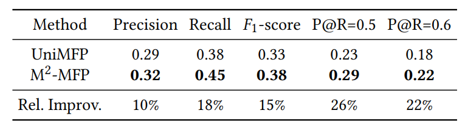

## 7 结论

本文提出 M2-MFP，一种用于主动内存故障预测的新型多尺度、多层级框架。M2-MFP 将多层级二值空间特征提取器与双路径时序建模结合起来，以有效捕捉可纠正错误（CE）中的关键模式。通过在华为云大规模真实数据集上的全面评估，我们证明该方法能够克服运行噪声、数据缺失、极端类别不平衡和硬件异构性等关键挑战。显著的性能提升（F1-score 约提升 15%）以及其在华为云 AIOps 平台上的成功部署，凸显了 M2-MFP 在保障云基础设施稳定运行方面的实际价值，并为更智能、自动化的主动维护系统提供了启示。

## 致谢

本工作受到国家自然科学基金（编号 92367110）资助。感谢华为云提供数据和资源支持。

## 参考文献

参考文献条目保留原文，以避免引文题名和出版信息失真。

[1] 2017. Memory RAS Configuration User's guide. Retrieved Dec 22, 2017 from https://www.supermicro.com/manuals/other/MemoryRASConfigurationUserGuide.pdf

[2] Majed Valad Beigi, Yi Cao, Sudhanva Gurumurthi, Charles Recchia, Andrew Walton, and Vilas Sridharan. 2023. A systematic study of ddr4 dram faults in the field. In 2023 IEEE International Symposium on High-Performance Computer Architecture (HPCA). IEEE, 991-1002.

[3] Jasmin Bogatinovski, Odej Kao, Qiao Yu, and Jorge Cardoso. 2022. First ce matters: On the importance of long term properties on memory failure prediction. In 2022 IEEE International Conference on Big Data (Big Data). IEEE, 4733-4736.

[4] Isaac Boixaderas, Darko Zivanovic, Sergi Moré, Javier Bartolome, David Vicente, Marc Casas, Paul M Carpenter, Petar Radojković, and Eduard Ayguadé. 2020. Cost-aware prediction of uncorrected DRAM errors in the field. In SC20: International Conference for High Performance Computing, Networking, Storage and Analysis. IEEE, 1-15.

[5] Zhinan Cheng, Shujie Han, Patrick PC Lee, Xin Li, Jiongzhou Liu, and Zhan Li. 2022. An in-depth correlative study between DRAM errors and server failures in production data centers. In 2022 41st International Symposium on Reliable Distributed Systems (SRDS). IEEE, 262-272.

[6] Kjersten Criss, Kuljit Bains, Rajat Agarwal, Tanj Bennett, Terry Grunzke, Jangryul Keith Kim, Hoeju Chung, and Munseon Jang. 2020. Improving memory reliability by bounding DRAM faults: DDR5 improved reliability features. In Proceedings of the International Symposium on Memory Systems. 317-322.

[7] Lingfei Deng, Yunong Wang, Haoran Wang, Xuhua Ma, Xiaoming Du, Xudong Zheng, and Dongrui Wu. 2024. Time-Aware Attention-Based Transformer (TAAT) for Cloud Computing System Failure Prediction. In Proceedings of the 30th ACM SIGKDD Conference on Knowledge Discovery and Data Mining. 4906-4917.

[8] Alexey Dosovitskiy. 2020. An image is worth 16x16 words: Transformers for image recognition at scale. arXiv preprint arXiv:2010.11929 (2020).

[9] Xiaoming Du and Cong Li. 2018. Memory failure prediction using online learning. In Proceedings of the International Symposium on Memory Systems. 38-49.

[10] Xiaoming Du and Cong Li. 2021. Predicting uncorrectable memory errors from the correctable error history: No free predictors in the field. In Proceedings of the International Symposium on Memory Systems. 1-10.

[11] Xiaoming Du, Cong Li, Shen Zhou, Mao Ye, and Jing Li. 2020. Predicting uncorrectable memory errors for proactive replacement: An empirical study on large-scale field data. In 2020 16th European Dependable Computing Conference (EDCC). IEEE, 41-46.

[12] Chiming Duan, Fangkai Yang, Pu Zhao, Lingling Zheng, Yash Dagli, Yudong Liu, Qingwei Lin, and Dongmei Zhang. 2024. SOIL: Score Conditioned Diffusion Model for Imbalanced Cloud Failure Prediction. In Companion Proceedings of the ACM Web Conference 2024. 65-72.

[13] Ioana Giurgiu, Jacint Szabo, Dorothea Wiesmann, and John Bird. 2017. Predicting DRAM reliability in the field with machine learning. In Proceedings of the 18th ACM/IFIP/USENIX Middleware Conference: Industrial Track. 15-21.

[14] Haixuan Guo, Shuhan Yuan, and Xintao Wu. 2021. Logbert: Log anomaly detection via bert. In 2021 international joint conference on neural networks (IJCNN). IEEE, 1-8.

[15] Qinda Hai, Shuangwang Zhang, Chang Liu, and Guojun Han. 2022. Hard disk drive failure prediction based on gru neural network. In 2022 IEEE/CIC International Conference on Communications in China (ICCC). IEEE, 696-701.

[16] Andy A Hwang, Ioan A Stefanovici, and Bianca Schroeder. 2012. Cosmic rays don't strike twice: Understanding the nature of DRAM errors and the implications for system design. ACM SIGPLAN Notices 47, 4 (2012), 111-122.

[17] Guolin Ke, Qi Meng, Thomas Finley, Taifeng Wang, Wei Chen, Weidong Ma, Qiwei Ye, and Tie-Yan Liu. 2017. Lightgbm: A highly efficient gradient boosting decision tree. Advances in neural information processing systems 30 (2017).

[18] Samira Khan, Donghyuk Lee, and Onur Mutlu. 2016. PARBOR: An efficient system-level technique to detect data-dependent failures in DRAM. In 2016 46th Annual IEEE/IFIP International Conference on Dependable Systems and Networks (DSN). IEEE, 239-250.

[19] Samira Khan, Chris Wilkerson, Donghyuk Lee, Alaa R Alameldeen, and Onur Mutlu. 2016. A case for memory content-based detection and mitigation of data-dependent failures in DRAM. IEEE Computer Architecture Letters 16, 2 (2016), 88-93.

[20] Alex Krizhevsky, Ilya Sutskever, and Geoffrey E Hinton. 2012. Imagenet classification with deep convolutional neural networks. Advances in neural information processing systems 25 (2012).

[21] Cong Li, Yu Zhang, Jialei Wang, Hang Chen, Xian Liu, Tai Huang, Liang Peng, Shen Zhou, Lixin Wang, and Shijian Ge. 2022. From correctable memory errors to uncorrectable memory errors: What error bits tell. In SC22: International Conference for High Performance Computing, Networking, Storage and Analysis. IEEE, 01-14.

[22] Xin Li, Michael C Huang, Kai Shen, and Lingkun Chu. 2007. An empirical study of memory hardware errors in a server farm. In The 3rd Workshop on Hot Topics in System Dependability (HotDep'07). Citeseer.

[23] Qingwei Lin, Tianci Li, Pu Zhao, Yudong Liu, Minghua Ma, Lingling Zheng, Murali Chintalapati, Bo Liu, Paul Wang, Hongyu Zhang, et al. 2023. Edits: An easy-to-difficult training strategy for cloud failure prediction. In Companion Proceedings of the ACM Web Conference 2023. 371-375.

[24] Zhexiong Liu. 2023. STIM: Predicting Memory Uncorrectable Errors with Spatio-Temporal Transformer. https://api.semanticscholar.org/CorpusID:267755744

[25] Xianting Lu, Yunong Wang, Yu Fu, Qi Sun, Xuhua Ma, Xudong Zheng, and Cheng Zhuo. 2024. MISP: A Multimodal-based Intelligent Server Failure Prediction Model for Cloud Computing Systems. In Proceedings of the 30th ACM SIGKDD Conference on Knowledge Discovery and Data Mining. 5509-5520.

[26] Justin Meza, Qiang Wu, Sanjeev Kumar, and Onur Mutlu. 2015. Revisiting memory errors in large-scale production data centers: Analysis and modeling of new trends from the field. In 2015 45th Annual IEEE/IFIP International Conference on Dependable Systems and Networks. IEEE, 415-426.

[27] Paolo Notaro, Qiao Yu, Soroush Haeri, Jorge Cardoso, and Michael Gerndt. 2023. An optical transceiver reliability study based on sfp monitoring and os-level metric data. In 2023 IEEE/ACM 23rd International Symposium on Cluster, Cloud and Internet Computing (CCGrid). IEEE, 1-12.

[28] Bianca Schroeder, Eduardo Pinheiro, and Wolf-Dietrich Weber. 2009. DRAM errors in the wild: a large-scale field study. ACM SIGMETRICS Performance Evaluation Review 37, 1 (2009), 193-204.

[29] Vilas Sridharan, Nathan DeBardeleben, Sean Blanchard, Kurt B Ferreira, Jon Stearley, John Shalf, and Sudhanva Gurumurthi. 2015. Memory errors in modern systems: The good, the bad, and the ugly. ACM SIGARCH Computer Architecture News 43, 1 (2015), 297-310.

[30] Vilas Sridharan and Dean Liberty. 2012. A study of DRAM failures in the field. In SC'12: Proceedings of the International Conference on High Performance Computing, Networking, Storage and Analysis. IEEE, 1-11.

[31] A Vaswani. 2017. Attention is all you need. Advances in Neural Information Processing Systems (2017).

[32] Guosai Wang, Lifei Zhang, and Wei Xu. 2017. What can we learn from four years of data center hardware failures?. In 2017 47th Annual IEEE/IFIP International Conference on Dependable Systems and Networks (DSN). IEEE, 25-36.

[33] Xingyi Wang, Yu Li, Yiquan Chen, Shiwen Wang, Yin Du, Cheng He, YuZhong Zhang, Pinan Chen, Xin Li, Wenjun Song, et al. 2021. On workload-aware dram failure prediction in large-scale data centers. In 2021 IEEE 39th VLSI Test Symposium (VTS). IEEE, 1-6.

[34] Da Xu, Chuanwei Ruan, Evren Korpeoglu, Sushant Kumar, and Kannan Achan. 2019. Self-attention with functional time representation learning. Advances in neural information processing systems 32 (2019).

[35] Qibo Yang, Xiaodong Jia, Xiang Li, Jianshe Feng, Wenzhe Li, and Jay Lee. 2020. Evaluating feature selection and anomaly detection methods of hard drive failure prediction. IEEE Transactions on Reliability 70, 2 (2020), 749-760.

[36] Fengyuan Yu, Hongzuo Xu, Songlei Jian, Chenlin Huang, Yijie Wang, and Zhiyue Wu. 2021. Dram failure prediction in large-scale data centers. In 2021 IEEE International Conference on Joint Cloud Computing (JCC). IEEE, 1-8.

[37] Qiao Yu, Jorge Cardoso, and Odej Kao. 2024. Unveiling DRAM Failures Across Different CPU Architectures in Large-Scale Datacenters. In 2024 IEEE 44th International Conference on Distributed Computing Systems (ICDCS). 1462-1463. doi:10.1109/ICDCS60910.2024.00152

[38] Qiao Yu, Wengui Zhang, Jorge Cardoso, and Odej Kao. 2023. Exploring Error Bits for Memory Failure Prediction: An In-Depth Correlative Study. In 2023 IEEE/ACM International Conference on Computer Aided Design (ICCAD). IEEE, 01-09.

[39] Qiao Yu, Wengui Zhang, Paolo Notaro, Soroush Haeri, Jorge Cardoso, and Odej Kao. 2023. Himfp: Hierarchical intelligent memory failure prediction for cloud service reliability. In 2023 53rd Annual IEEE/IFIP International Conference on Dependable Systems and Networks (DSN). IEEE, 216-228.

[40] Qiao Yu, Wengui Zhang, Min Zhou, Jialiang Yu, Zhenli Sheng, Jasmin Bogatinovski, Jorge Cardoso, and Odej Kao. 2024. Investigating Memory Failure Prediction Across CPU Architectures. In 2024 54th Annual IEEE/IFIP International Conference on Dependable Systems and Networks - Supplemental Volume (DSN-S). 88-95. doi:10.1109/DSN-S60304.2024.00033

[41] Min Zhou, Hongyi Xie, Qiao Yu, Jialiang Yu, and Zhenli Sheng. 2025. Smart-Mem: Memory Failure Prediction Challenge at WWW 2025. In Companion Proceedings of the ACM on Web Conference 2025 (Sydney NSW, Australia) (WWW '25). Association for Computing Machinery, New York, NY, USA, 3003-3007. doi:10.1145/3701716.3719148

## 附录

### A 数据集细节

我们的数据集包含来自 Intel Purley 和 Intel Whitley DIMM 的日志数据，采集自 2024 年 1 月至 9 月期间超过 70,000 个 DIMM。对于每个月，我们统计包含 CE 日志的 DIMM 数、发生故障的 DIMM 数，以及记录的 CE 事件总数。结果见表 6。需要注意，每月 DIMM 数之和并不等于总 DIMM 数，因为部分 DIMM 在多个月份中都有 CE 日志。

表 7 列出了每条 CE 日志包含的字段，这些字段通过 mcelog 收集为 23 列。注意，厂商、区域等敏感信息已根据保密策略进行匿名化。

> 注：当前图片目录中未提供表 6 和表 7 的独立图片，因此下方以中文表格保留其内容。

| 月份    | Intel Purley DIMM 数 | Intel Purley 故障 DIMM 数 | Intel Purley CE 数 | Intel Whitley DIMM 数 | Intel Whitley 故障 DIMM 数 | Intel Whitley CE 数 | 总 DIMM 数 | 总故障 DIMM 数 |   总 CE 数 |
| ------- | -------------------: | ------------------------: | -----------------: | --------------------: | -------------------------: | ------------------: | ---------: | -------------: | ---------: |
| 2024-01 |                26450 |                       163 |          102423615 |                  1466 |                         15 |             1843056 |      27916 |            178 |  104266671 |
| 2024-02 |                24682 |                       133 |           97336381 |                  1682 |                          8 |             1763660 |      26364 |            141 |   99100041 |
| 2024-03 |                26919 |                       174 |          106745981 |                  1948 |                         16 |             1682764 |      28867 |            190 |  108428745 |
| 2024-04 |                29776 |                       144 |          107168332 |                  2067 |                         17 |             1947564 |      31843 |            161 |  109115896 |
| 2024-05 |                29046 |                       155 |          119407409 |                  2191 |                         12 |             2494964 |      31237 |            167 |  121902373 |
| 2024-06 |                32610 |                       169 |          118064609 |                  2270 |                         16 |             2580721 |      34880 |            185 |  120645330 |
| 2024-07 |                37853 |                       250 |          148794345 |                  2564 |                         19 |             3604404 |      40417 |            269 |  152398749 |
| 2024-08 |                37531 |                       214 |          165111964 |                  2631 |                         18 |             3564878 |      40162 |            232 |  168676842 |
| 2024-09 |                37613 |                       160 |          158444298 |                  2668 |                         21 |             3296809 |      40281 |            181 |  161741107 |
| Total   |                64794 |                      1562 |         1123496934 |                  7175 |                        142 |            22778820 |      71969 |           1704 | 1146275754 |

| 编号 | 字段                | 层级   | 类型     | 描述                                                     |
| ---: | ------------------- | ------ | -------- | -------------------------------------------------------- |
|    1 | cpuid               | server | integer  | CPU ID；一台服务器连接多个 CPU。                         |
|    2 | channelid           | server | integer  | Channel ID；一个 CPU 有多个 channel。                    |
|    3 | dimmid              | server | integer  | DIMM ID；一个 channel 连接多个 DIMM。                    |
|    4 | rankid              | DIMM   | integer  | rank ID，范围 0 到 1；每个 DIMM 有 1 或 2 个 rank。      |
|    5 | deviceid            | DIMM   | integer  | device ID，范围 0 到 17；每个 DIMM 有多个 device。       |
|    6 | bankgroupid         | DIMM   | integer  | DRAM 的 bank group ID。                                  |
|    7 | bankid              | DIMM   | integer  | DRAM 的 bank ID。                                        |
|    8 | rowid               | DIMM   | integer  | DRAM 的 row ID。                                         |
|    9 | columnid            | DIMM   | integer  | DRAM 的 column ID。                                      |
|   10 | retryrderrlogparity | bit    | integer  | 十进制格式的重试读奇偶校验信息。                         |
|   11 | retryrderrlog       | bit    | integer  | 十进制格式的重试读日志信息，用于验证错误类型和奇偶校验。 |
|   12 | beat_info           | bit    | integer  | 内存 DQ 和 Beat 中解码后的奇偶校验错误 bit。             |
|   13 | error_type          | other  | integer  | 错误类型，包括读错误和 scrub 错误。                      |
|   14 | log_time            | other  | string   | 检测到错误时的时间戳。                                   |
|   15 | manufacturter       | server | category | 匿名化格式的服务器厂商。                                 |
|   16 | model               | server | category | 匿名化格式的 CPU 型号。                                  |
|   17 | PN                  | server | category | 匿名化格式的 DIMM 部件号。                               |
|   18 | Capacity            | server | integer  | DIMM 容量。                                              |
|   19 | FrequencyMHz        | server | integer  | CPU 资源的基准频率，单位 MHz。                           |
|   20 | MaxSpeedMHz         | server | integer  | CPU 资源的最高频率。                                     |
|   21 | McaBank             | server | category | CPU 的 Machine Check Architecture bank 编码。            |
|   22 | memory_type         | server | string   | DIMM 类型，例如 DDR4。                                   |
|   23 | region              | server | category | 匿名化格式的服务器区域。                                 |

### B 实现细节

#### B.1 时间点方法

##### B.1.1 Naive 方法

每个 CE 被表示为 DQ-Beat 矩阵 `B(e) in {0,1}^{8 x 4}`，其中行表示 beat，列表示 DQ。令 `n+(B(e))` 和 `n-(B(e))` 分别统计其在正样本和负样本中的出现次数。

若满足以下条件，则 CE 被标记为故障：

```text
n+(B(e)) > n-(B(e)).
```

##### B.1.2 Risky CE 规则

该规则检查 `B(e)` 中 DQ0 到 DQ3 信号上的 bit 级错误。

若满足以下条件，则 CE 为故障：

```text
(e(DQ0) + e(DQ1) >= 1) and (e(DQ2) + e(DQ3) >= 1).
```

##### B.1.3 DQ Beat Predictor

该方法统计 DQ 和 Beat 中的错误：

```text
N_DQ = 有错误的 DQ 数量,  N_Beat = 有错误的 Beat 数量.
```

若满足以下条件，则 CE 为故障：

```text
N_DQ > 1 and N_Beat > 1.
```

##### B.1.4 基于 CNN 的方法（时间点）

该方法的输入为二值 DQ-Beat 矩阵：

```text
X in {0,1}^{8 x 4},
```

表示 CE 的 bit 级特征（等同于 `B(e)`）。该方法采用与时间片方法类似的 CNN-MLP 混合架构。具体而言，模型通过并行路径处理输入：

```text
H_CNN = sigma(W_conv * X + b_conv),                                             (20)
H_MLP = sigma(W_2 · sigma(W_1 x + b_1) + b_2),                                  (21)
y = Softmax(W_c [H_CNN concat H_MLP] + b_c),                                    (22)
```

其中 `*` 表示卷积操作，`concat` 表示拼接，`sigma` 为 ReLU 激活函数。这里 `x in R^8` 表示 DIMM 级 CE 统计特征。

#### B.2 时间片方法

##### B.2.1 基于 CNN 的方法

该模型结合用于图像处理的 CNN 和用于统计特征的 MLP：

- CNN 分支：输入为 8 x 4 DQ-Beat 矩阵；层结构为 3 x 3 卷积（32 个 filter，padding 1）-> 2 x 2 最大池化 -> flatten -> FC(128)；正则化为 FC 层后 Dropout（p=0.1）。
- MLP 分支：输入为 8 维 CE 特征；层结构为 FC(8->64) -> Dropout(0.1) -> FC(64->128)。

组合特征 `h_combined in R^256` 经如下方式分类：

```text
y = W_combined h_combined,  W in R^{2 x 256}.
```

##### B.2.2 基于 1D CNN 的方法

该方法包含双 1D 卷积路径：

- 行路径：(1,4) 卷积 -> (8,1) 最大池化（stride 8,1）-> 额外卷积 -> 32 维特征。
- 列路径：(8,1) 卷积 -> (1,4) 最大池化（stride 1,4）-> 额外卷积 -> 32 维特征。

特征拼接为 128 维 -> FC(128) -> Dropout(0.1)。随后与 MLP 分支（同上）结合进行最终分类。

##### B.2.3 基于 ViT 的方法

该方法通过 Transformer 处理图像 patch（`p x p`）：

- Patch embedding：1 x 1 patch（`p=1`）-> 128 维 embedding；
- class token + 可学习位置 embedding；
- Transformer：3 层、4 个 head、256 维 MLP；
- 最终分类使用 class token 表示。

MLP 分支单独处理 8 维特征。组合特征通过线性层分类。

##### B.2.4 基于 1D ViT 的方法

该方法为双分支 1D ViT：

- 分支 1：长度为 8 的 patch（N=4），2 层；
- 分支 2：长度为 4 的 patch（N=8），2 层；
- 两个分支均使用 4 个注意力 head，`d=128`；
- 与 MLP 分支（`d=128`）结合。

最终在 `R^384` 的组合特征上分类。

### C 评估细节

在真实场景中，为适配基于流式数据的内存故障预测任务，内存故障预测模型必须满足以下要求：

- 当在时间 `t` 预测未来是否会发生故障时，模型只能使用时间 `t` 之前可用的日志数据；
- 对每次预测，分配的预测时间戳不得早于输入数据中最新日志条目的时间戳；
- 历史预测不得被未来预测改变，即时间 `t` 作出的预测不应受 `t` 之后预测的影响。

令 `t` 表示预测时间戳，并定义预测窗口：

```text
T_pred(t) = [t + Delta_t_lead, t + Delta_t_lead + Delta_t_p],
```

其中 `Delta_t_lead = 15` 分钟为最小提前时间，`Delta_t_p = 7` 天为预测跨度。令 `F` 表示测试期间发生故障的 DIMM 集合，`t_f^s` 表示 DIMM `s` 的故障时间。

若满足以下条件，则 DIMM `s` 在时间 `t` 的预测被视为正确：

```text
y_pred,s(t) = 1 and t_f^s in T_pred(t).
```

我们定义以下集合以形式化评估指标：

1. 预测 DIMM：测试期间至少收到一次故障预测的所有 DIMM 集合：

```text
S_pred = {s | exists t（在测试期间）使得 y_pred,s(t)=1}.                         (23)
```

2. 正确预测 DIMM：满足以下条件的 DIMM 集合：1. 在测试期间实际发生故障；2. 至少存在一次在时间 `t` 发出的预测，且故障时间 `t_f^s` 落入对应预测窗口：

```text
S_true = {s in F | exists t 使得 y_pred,s(t)=1 and t_f^s in T_pred(t)}.          (24)
```

评估指标计算如下：

Precision 衡量所有至少收到一次预测的 DIMM 中，被正确预测的 DIMM 比例。其分子和分母为：

```text
Precision Numerator = |S_true|,                                                (25)
Precision Denominator = |S_pred|,                                              (26)
Precision = |S_true| / |S_pred|.                                               (27)
```

Recall 衡量实际故障中被正确预测的比例。其分子与 Precision 相同，分母为测试期间发生故障的 DIMM 总数：

```text
Recall Numerator = |S_true|,                                                   (28)
Recall Denominator = |F|,                                                      (29)
Recall = |S_true| / |F|.                                                       (30)
```

F1 Score 是 Precision 和 Recall 的调和平均：

```text
F1 = 2 · Precision · Recall / (Precision + Recall).                            (31)
```

其中 `|.|` 表示集合基数。
