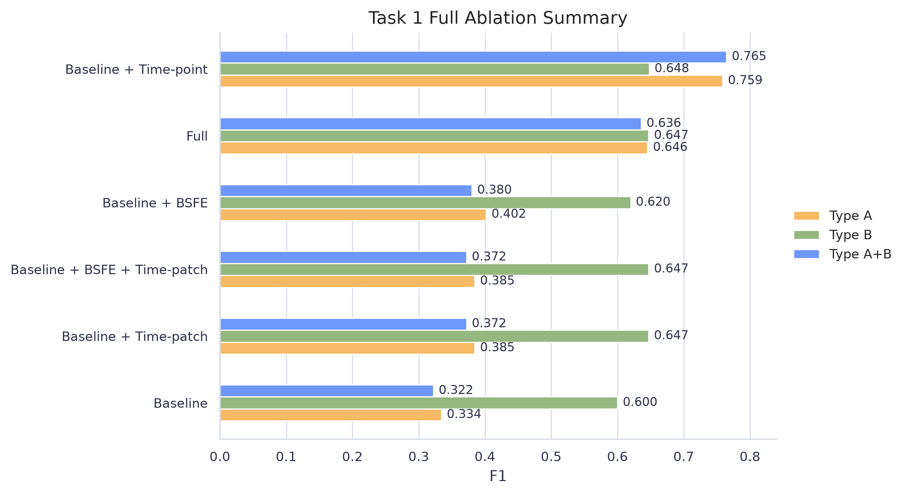
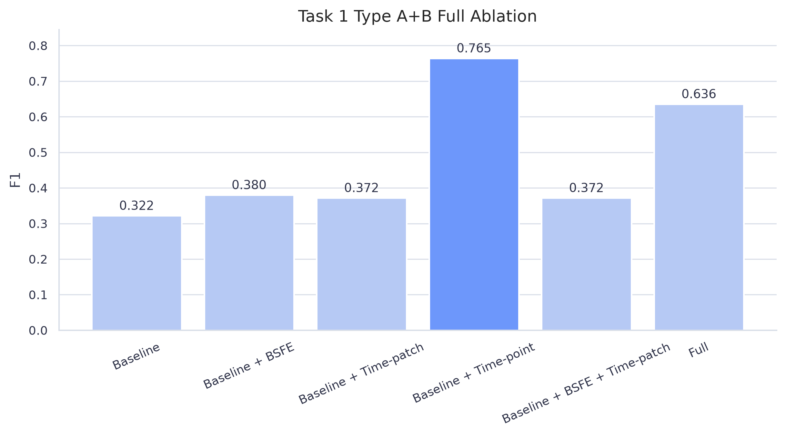
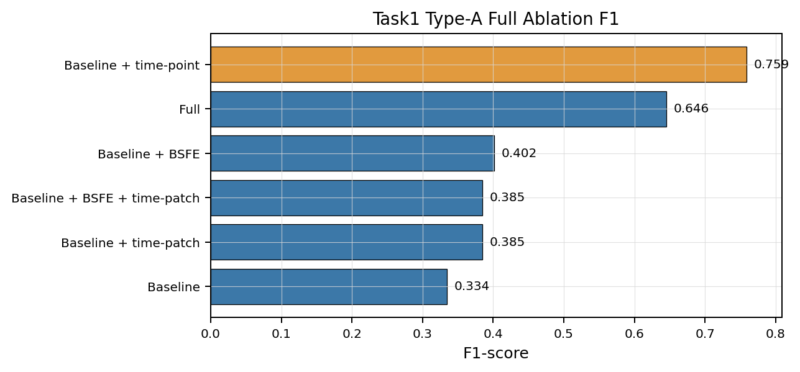
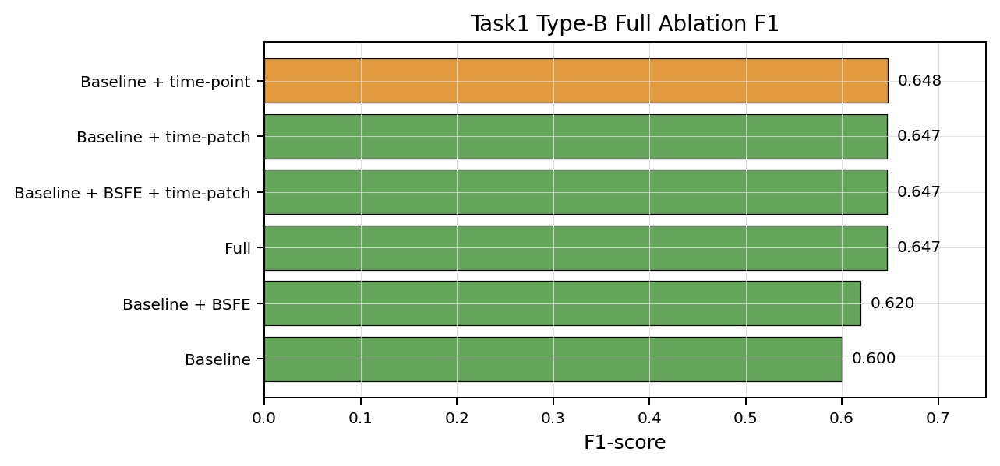
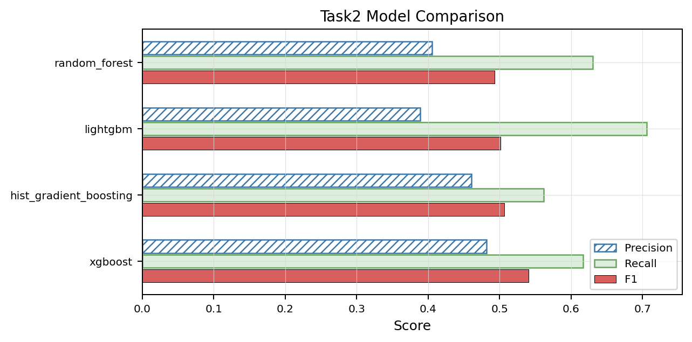
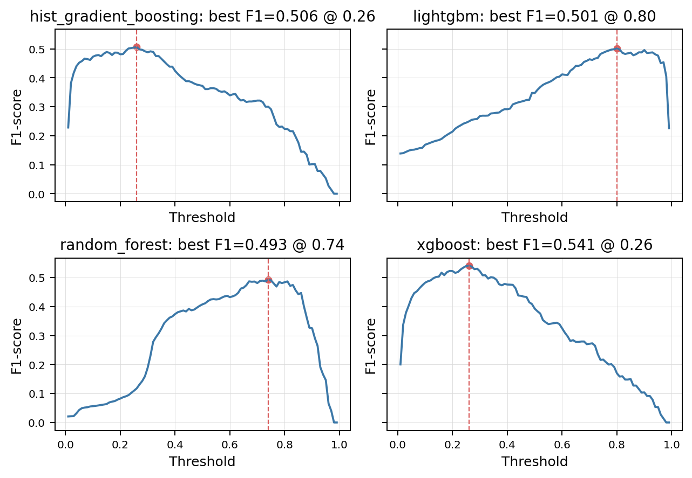
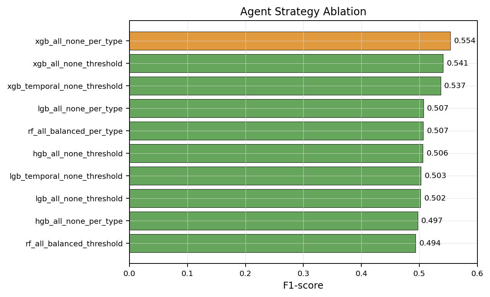
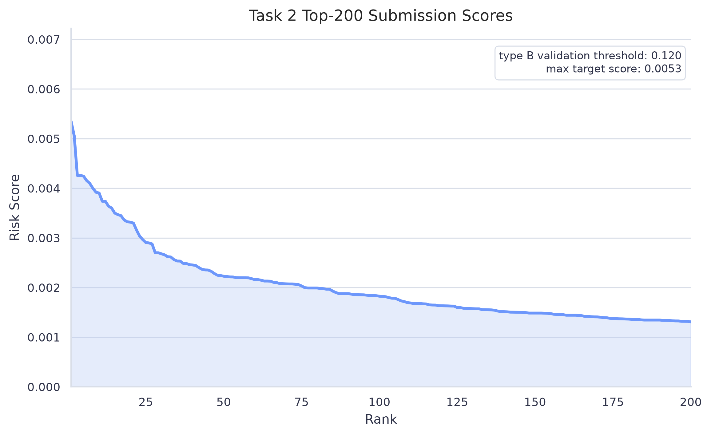
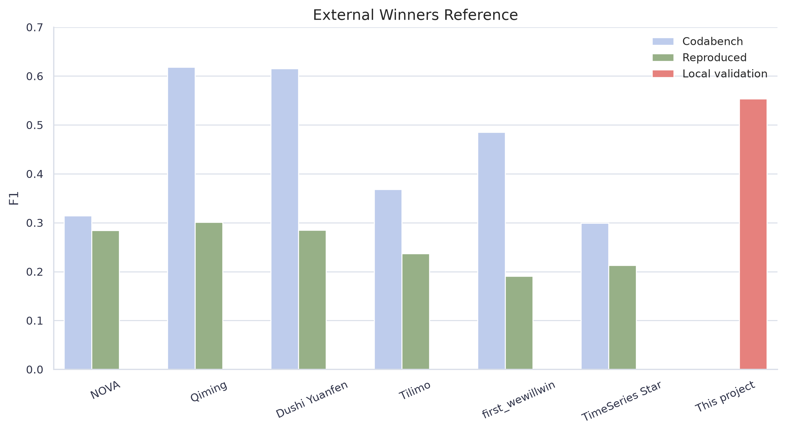

# UCAS OS 实验七研究报告

题目：内存故障预测：M2-MFP 特征复现与 SmartHW Stage2 Agent 策略搜索

课程：操作系统实验七

日期：2026 年 6 月

## 小组成员贡献声明

| 成员   | 学号            | 主要贡献                                                       |
| ------ | --------------- | -------------------------------------------------------------- |
| 刘卓敏 | 2025E8021682115 | 文献阅读、项目统筹、任务一 M2-MFP 特征复现、问题整理、报告整合 |
| 冯镒铤 | 2025E8021682149 | 任务二 Stage2 模型训练、submission 检查、图表整理、PPT 制作    |
| 杨璟文 | 2025E8021682036 | 文献阅读、任务二 agent 策略搜索、答辩材料、问题记录、PPT 制作 |

## 摘要

本项目面向服务器内存故障预测任务。服务器 DRAM 在运行过程中会产生可纠正错误日志。单次 CE 不一定导致服务中断，但频繁、集中或具有特殊 bit 模式的 CE 往往说明某根 DIMM 正在退化。内存故障预测的目标，是在不可纠正错误或故障告警出现前给出风险判断，从而为迁移负载、更换硬件或调整运维策略留出时间。

项目包含两个子任务。任务一使用 SmartMem Stage1 原始 CE 日志，复现并检验 M2-MFP 风格特征，包括 BSFE、time-patch 和 time-point。任务二使用 SmartHW/SmartMem Stage2 官方预提取特征，训练表格模型，搜索阈值、采样方式、特征组和 per-type 策略，并生成离线候选 submission。

实验结果表明，任务一 A+B full 的最佳结果为 `baseline_time_point + random_forest_small`，F1 = 0.7645。任务二 baseline XGBoost 本地验证 F1 = 0.5405，agent 最佳策略 `xgb_all_none_per_type` 本地验证 F1 = 0.5538。Stage2 submission 为 200 行离线候选文件。当前 Codabench 评估入口关闭，项目没有 hidden-test F1。

关键词：内存故障预测；Correctable Error；M2-MFP；BSFE；time-point；SmartHW；XGBoost；Agent Search

## 1 研究背景

数据中心服务器依赖大量 DRAM 模块。DRAM 中的 bit 错误可以被 ECC 机制检测和纠正，并以 CE 日志形式记录。CE 的价值在于它保留了故障前的早期信号。若某个 DIMM 在短时间内出现密集 CE，或 CE 集中在特定 device、bank、row、column、cell，或 retry parity 中出现特殊 bit 模式，该 DIMM 后续发生 UE 或故障告警的概率可能升高。

SmartHW 项目将内存故障预测定义为二分类问题。在时间 `t`，模型观察历史窗口内的数据，预测未来 `[t + lead time, t + lead time + prediction window]` 内是否发生 UE。公开说明中固定 lead time 为 15 分钟，prediction window 为 7 天，并使用 F-score 评估预测质量。该任务存在几个直接困难：UE 样本稀少，CE 日志噪声较多，不同内存类型和硬件平台分布不同，硬件老化会带来时间漂移，真实访问机制中还存在未观测变量。

本项目沿用上述任务定义。任务一从 Stage1 原始 CE 日志中构造特征和标签，目标是检验 M2-MFP 风格特征是否能提供有效信号。任务二使用 Stage2 官方预提取表格特征，目标是完成模型训练、阈值搜索、agent 策略搜索和 submission 生成流程。

## 2 数据与任务划分

| 数据目录                |     规模 | 用途                                           |
| ----------------------- | -------: | ---------------------------------------------- |
| `data/stage1_feather` |  约 33GB | 任务一，M2-MFP raw-log 特征复现                |
| `data/stage2_feature` | 约 7.9GB | 任务二，模型训练、agent 搜索和 submission 生成 |
| `data/stage2_feather` |  约 46GB | raw-log 扩展实验，默认流程不使用               |

任务一读取 Stage1 原始 feather。每个 feather 文件对应一根 DIMM 的 CE 时间序列。`ticket.csv` 提供故障 DIMM 和故障时间。代码从原始 CE 日志构造监督学习样本，再比较 baseline、BSFE、time-patch、time-point 和 full 特征组合。任务一的重点是特征机制检验。公开 M2-MFP 仓库提供特征模块思路，但没有提供完整私有训练流水线。本项目使用 Logistic Regression 和轻量 RandomForest 做本地评估。

任务二读取 Stage2 官方预提取特征。每个 feather 文件包含某根 DIMM 的多时间点表格特征。`failure_ticket.csv` 提供故障标签。代码构造 `stage2_train_features.csv` 作为监督学习缓存表，并在缓存表上训练模型、搜索阈值和比较 agent 策略。任务二的重点是比赛式预测流程，包括模型选择、时间切分验证、阈值搜索、per-type 策略和目标期候选生成。

## 3 M2-MFP 论文讲解

M2-MFP 全名为 Multi-Scale and Multi-Level Memory Failure Prediction Framework。论文的基本判断是，UE 之前的 CE 日志包含时间、空间和 bit 级结构化信号。该方法将内存错误表示为多层级事件序列，并围绕 BSFE、time-patch 和 time-point 设计特征提取与预测流程。

### 3.1 故障预测系统和任务定义

M2-MFP 论文首先把内存故障预测放入 AIOps 运行流程中。BMC 持续收集服务器硬件状态和内存错误日志，AIOps 系统周期性训练模型，并在在线运行时以固定间隔检查近期日志。当模型判断某根 DIMM 在未来预测窗口内存在故障风险时，系统触发告警，运维人员据此执行迁移、诊断或更换。


图中展示了离线训练和在线预测的闭环。CE 日志先进入训练流程形成模型，在线阶段再用近期 CE 生成告警。该流程表明内存故障预测的输出属于面向未来窗口的风险判断。

论文中的任务定义包含两个时间概念。lead window 用于预留数据传输、模型推理和人工响应时间；prediction window 定义预测结果的有效范围。给定 DIMM `d` 及其历史 CE 事件 `E_d`，模型在观测时间 `t` 只能使用 `t` 之前的 CE 日志，预测 `d` 是否会在 `[t + lead, t + lead + valid]` 内发生故障。


图中把历史观测窗口、lead window 和 prediction window 分开。该定义直接对应本项目的样本构造逻辑：正样本特征必须截止到 lead window 之前，故障窗口内的日志不能进入特征侧。

### 3.2 内存层级与 bit 信息

服务器内存具有明确的硬件层级。一个服务器包含 CPU 和多个 DIMM；DIMM 包含 rank；rank 内有多个 DRAM device；device 继续划分为 bank、row、column 和 cell。CE 日志记录错误发生的层级地址，因此它不只是时间序列，也包含空间位置。


图中展示了 server、CPU、DIMM、rank、device、bank、row、column、cell 的层级关系。该结构解释了为什么 CE 日志中的 device、bank、row、column 和 cell 统计能作为空间特征。

除了 DIMM 级空间地址，CE 日志还包含 bit 级错误信息。对于 x4 DDR4 芯片，一次数据传输可以表示为 8 个 beat 和 4 条 DQ 线形成的 8x4 DQ-Beat 矩阵。M2-MFP 的一个重要设计，是把 retry parity 中的 32 位整数还原为该矩阵，再从矩阵中提取空间模式。


图中把 CE 分析分成时间、空间和 bit 三类维度。任务一复现工作也按这三类展开：baseline 处理基础时间和空间统计，BSFE 处理 bit 模式，time-patch 和 time-point 处理窗口和预测点附近的时间结构。

### 3.3 BSFE

BSFE 是 Binary Spatial Feature Extractor。它的输入是二值矩阵，输出是固定长度空间描述子。对于 bit 级 CE，输入可以是 8x4 DQ-Beat 矩阵。BSFE 分别沿行和列提取 bit 数量、相邻 1 的最小间隔、首尾 1 的最大跨度、最长连续 1 长度和连续聚集程度。随后，BSFE 使用 max、sum、avg 或 F-max 等方式聚合这些描述子。


图中展示了 BSFE 从二值矩阵到行列描述子的转换过程。该结构对应本项目 `bsfe.py` 中的实现：先把 32 位 parity 还原为 DQ-Beat 矩阵，再提取行方向和列方向的固定长度统计。

BSFE 的作用是把原始整数 parity 转成可解释的空间特征。直接把 32 位整数作为数值输入时，大小关系缺少硬件含义。转为 DQ-Beat 矩阵后，模型可以区分离散 bit 错误、同一 DQ 方向聚集、同一 beat 方向聚集等模式。

### 3.4 Time-patch

time-patch 面向时间窗口。它在 15m、1h、6h 等多尺度窗口内聚合 CE 强度、空间位置和 BSFE bit 特征，用于描述某根 DIMM 在最近一段时间内是否出现异常密集、异常集中或具有特殊 bit 模式的 CE。

论文中的 time-patch 模块与 LightGBM 等分类器结合。本项目使用 RandomForest 和 Logistic Regression 评估该类特征的本地贡献。由于公开仓库没有完整私有训练流水线，本项目复现和适配特征机制。

### 3.5 Time-point

time-point 面向预测时间点附近的异常事件。M2-MFP 论文使用 bit 级模式和定制决策树生成可解释规则。本项目没有复现论文私有决策树训练流程，而是实现了一组本地规则特征，包括最近 CE 到预测时间点的距离、最近 CE 的 interarrival gap、短窗口和长窗口 CE 数量比例、60s/300s 内最长连续 CE 链，以及 device、bank、row、column、cell 的 dominant ratio 和 unique count。


图中展示了 M2-MFP 的整体特征路径。CE 日志被拆解为多尺度时间窗口、多层级空间地址和 bit 级错误模式，再进入预测模型。本项目任务一对应其中公开模块可复现的特征部分。

这些 time-point 特征维度较少，含义直接，能够描述故障前突发和空间集中现象。实验结果表明，在本项目数据和模型设置下，time-point 是任务一中最稳定的特征组。

## 4 任务一：M2-MFP 特征复现与消融

### 4.1 任务一实现

任务一代码位于 `m2mfp-reproduction/`。配置文件位于 `configs/`，包括 type_A smoke、type_A full、type_B full 和 A+B full。`common/path_utils.py` 负责解析相对路径和 `MEMFAIL_DATA_ROOT`，使原始数据放在 Git 仓库之外。

`src/raw_smoke.py` 中的 `build_raw_smoke_features()` 完成样本构造。对于出现在 ticket 中的故障 DIMM，代码使用 `failure_time - lead_minutes` 作为正样本预测时刻，并且所有特征只读取该时间点之前的 CE 日志。故障 DIMM 的负样本取预测窗口之前的安全时间点，无故障 DIMM 取最后一条日志时间点。这样做是为了避免把 lead time 内或故障窗口内的日志放入错误标签。

baseline 是本项目自建对照组，不来自 M2-MFP 论文模块。它由 `aggregate_window_features()` 和 `parity_stats()` 实现，包含多窗口 CE count、READ/SCRUB CE count、unique device/bank/row/column、CE storm count 和低阶 parity bit 统计。baseline 的作用是提供基础统计对照，衡量 BSFE、time-patch 和 time-point 是否提供增量信息。

BSFE 实现在 `src/bsfe.py` 中。代码将 `RetryRdErrLogParity` 转为 32 位二进制字符串，并 reshape 为 8x4 DQ-Beat 矩阵。随后按行和按列提取 bit 结构特征，并输出固定列名。为了减少 full run 中的重复计算，代码预先缓存所有 4 位和 8 位二进制子串的特征。

time-patch 实现在 `src/time_patch.py` 中。该文件先通过 `normalize_ce_schema()` 统一字段类型，再在多个窗口内输出时间强度、空间模式和 bit 模式。字段规范化包括把 `LogTime` 转成整数、将缺失 device 记为 -1、将 retry parity 和 retry log 转为整数、增加 READ/SCRUB 标志，以及构造 `CellId`。空间统计会排除 -1，避免把缺失值误认为真实地址扩散。

time-point 实现在 `src/time_point.py` 中。它只使用 `end_time` 之前的日志，并输出 `last_gap_seconds`、`min_interarrival_seconds`、`median_interarrival_seconds`、`burstiness`、`short_long_ratio`、`max_run_60s`、`max_run_300s` 以及短窗口 dominant ratio 和 unique count。

消融实验由 `src/ablation.py` 统一运行。它先生成或读取包含全部候选特征的缓存表，再通过 `filter_feature_groups()` 切出不同特征组合。消融组包括 baseline、baseline + BSFE、baseline + time-patch、baseline + time-point、baseline + BSFE + time-patch 和 full。所有消融共享同一批样本，结果差异主要来自可见特征列。

### 4.2 任务一结果

| Dataset              | Best ablation       | Model               | Precision | Recall |     F1 |
| -------------------- | ------------------- | ------------------- | --------: | -----: | -----: |
| type_A smoke         | baseline_time_point | random_forest_small |    0.7078 | 0.7474 | 0.7270 |
| type_A full          | baseline_time_point | random_forest_small |    0.6372 | 0.9375 | 0.7587 |
| type_B full          | baseline_time_point | random_forest_small |    0.6216 | 0.6765 | 0.6479 |
| type_A + type_B full | baseline_time_point | random_forest_small |    0.6355 | 0.9593 | 0.7645 |

任务一合并图把 type_A full、type_B full 和 A+B full 的各消融 F1 放在同一坐标系中。图中可以看到 `baseline_time_point` 在三组 full 实验中均位于前列，A+B full 达到 0.7645。type_B 的多个 M2-MFP 风格特征组合接近 0.647，说明 type_B 正样本少时细小差异解释范围受限。



A+B full 消融图展示了混合 type_A/type_B 数据下的特征贡献。`baseline_time_point` 明显高于 baseline，也高于直接拼接全部特征的 full 组合。该结果支撑任务一结论：预测点附近的局部异常特征在本地配置下最稳定。



type_A full 消融图显示，`baseline_time_point` 的 F1 为 0.7587，明显高于 baseline 和其他组合。type_A 数据中的正样本数量高于 type_B，因此该图是任务一结论的重要依据。



type_B full 消融图显示，baseline 到 time-patch、time-point 和 full 的提升存在，但多个组合之间差异很小。该图用于说明 type_B 上存在 M2-MFP 风格特征信号，同时需要结合正样本规模解释。



结果显示，time-point 在 Stage1 原始日志上表现稳定。BSFE 和 time-patch 相对 baseline 有信号，但 full 特征组合没有超过 `baseline_time_point`。更多特征列不一定直接带来更好泛化。full 特征引入数百维窗口和 bit 特征，在正样本仍少的情况下可能增加噪声。type_B full 的正样本只有 68 个，因此 type_B 中 time-patch、time-point 和 full 之间的细小 F1 差异解释范围受限。

## 5 任务二：SmartHW Stage2 预测与 agent 搜索

### 5.1 任务二实现

SmartHW 任务要求根据内存配置、错误日志和故障标签预测未来观察期内的 DRAM 模块故障。Stage2 引入混合内存模型，强调泛化、few-shot 和知识迁移能力。本项目任务二选择 Stage2 官方预提取特征作为主线。官方特征已经包含 15m、1h、6h 等窗口统计，适合直接训练表格模型。重新处理 Stage2 raw feather 会读取约 46GB 数据，收口阶段默认使用官方预提取特征。

任务二代码位于 `memory-failure-prediction-agent/`。`src/stage2_feature_pipeline.py` 中的 `build_training_table()` 从官方特征构造监督学习表。数据流为：`stage2_feature/type_A/*.feather` 和 `stage2_feature/type_B/*.feather` 与 `failure_ticket.csv` 结合，生成 `results/stage2_feature/stage2_train_features.csv`。该缓存表保存监督学习样本，不是下载得到的原始文件。

任务二的正样本来自故障前 7 天到 lead time 之间的最后一个特征点。故障 DIMM 的负样本来自更早安全时间点，无故障 DIMM 的负样本来自最后一个特征点。随后，`time_split()` 使用 `prediction_timestamp` 做时间切分，默认较早时间训练、较晚时间验证。这个设计用于模拟时间分布漂移。

候选模型包括 RandomForest、HistGradientBoosting、LightGBM 和 XGBoost。SmartHW starter kit 演示 XGBoost，官方 baseline 使用 LightGBM。本项目加入 RandomForest 和 HistGradientBoosting 作为对照。由于正样本比例约 1%，任务二不固定使用 0.5 阈值，而是在验证集上遍历 0.01 到 0.99，按 F1、recall、precision 排序保存最佳阈值。

agent 搜索由 `src/agent_search.py` 实现。每个 `AgentStrategy` 固定模型、特征组、采样方式、决策方式和是否 per-type。per-type 策略先做一次全局时间切分，再在 train/valid 内按 type_A/type_B 分别训练和验证。per-type 和单模型策略共享同一验证时间段，F1 具有可比性。

提交期还要处理特征列对齐。Stage2 官方 feather 在 type_A/type_B 间列空间不完全一致，部分 type_B 文件缺少 6h 窗口列。`align_prediction_features()` 会按训练列顺序重排，缺失列补 0，多余列丢弃，保证预测矩阵和训练矩阵列空间一致。

### 5.2 任务二结果

| Model                | Threshold | Precision | Recall |     F1 |
| -------------------- | --------: | --------: | -----: | -----: |
| XGBoost              |      0.26 |    0.4813 | 0.6164 | 0.5405 |
| HistGradientBoosting |      0.26 |    0.4607 | 0.5616 | 0.5062 |
| LightGBM             |      0.80 |    0.3887 | 0.7055 | 0.5012 |
| RandomForest         |      0.74 |    0.4053 | 0.6301 | 0.4933 |

模型对比图同时展示 precision、recall 和 F1。XGBoost 的 F1 最高，为 0.5405；LightGBM 的 recall 较高，但 precision 较低，最终 F1 低于 XGBoost。该图说明任务二模型选择不能只看召回率，还要平衡误报。



阈值搜索面板展示每个模型在不同 threshold 下的 precision、recall 和 F1 曲线。红色虚线表示验证集 F1 最优阈值。XGBoost 和 HistGradientBoosting 的最佳阈值为 0.26，LightGBM 和 RandomForest 需要更高阈值才能取得各自最佳 F1。该图解释了为什么任务二没有使用默认 0.5 阈值。



agent 搜索的 Top-5 结果如下。

| Strategy                    | Precision | Recall |     F1 | Threshold |
| --------------------------- | --------: | -----: | -----: | --------: |
| xgb_all_none_per_type       |    0.5028 | 0.6164 | 0.5538 |      0.28 |
| xgb_all_none_threshold      |    0.4863 | 0.6096 | 0.5410 |      0.27 |
| xgb_temporal_none_threshold |    0.5030 | 0.5753 | 0.5367 |      0.31 |
| lgb_all_none_per_type       |    0.3877 | 0.7329 | 0.5071 |      0.78 |
| rf_all_balanced_per_type    |    0.4272 | 0.6233 | 0.5070 |      0.79 |

agent 策略图展示搜索得到的前若干策略。`xgb_all_none_per_type` 排名第一，F1 为 0.5538，高于单一 XGBoost baseline。该结果说明 per-type 策略在本地验证集上保留了 type_A/type_B 的分布差异。



最佳 per-type 策略生成离线候选 submission。文件路径为 `memory-failure-prediction-agent/results/stage2_feature/stage2_best_per_type_submission.csv`。该文件包含 200 行，列为 `serial_number`、`prediction_timestamp`、`serial_number_type`，无空值，无重复 `serial_number`，时间戳位于目标预测期。

目标期样本分数均低于 per-type 验证阈值，因此 submission 使用 top-k 兜底，从每个 DIMM 的目标期最高风险点中取 top-200。该文件记录候选生成流程和提交格式。当前 Codabench 评估入口关闭，项目没有 hidden-test 分数。

submission 分数图展示最终 200 个候选 DIMM 的目标期风险分数排序。最高目标期分数约为 0.00535，低于 type_B 验证阈值 0.12。该图传达的结论是：目标期阈值筛选没有命中样本，最终文件来自 top-k fallback；图中分数用于解释候选排序，不表示 hidden-test F1。



## 6 问题与解决

### 6.1 样本构造中的时间边界

内存故障预测的标签来自故障 ticket。若直接使用故障发生前紧邻时刻的 CE 日志，模型会接触到 lead time 内的异常信号，验证指标会偏高。任务一将故障 DIMM 的正样本预测时刻设为 `failure_time - lead_minutes`，并且所有窗口特征只读取该时刻以前的 CE。任务二在官方特征中选择 `[alarm_time - lead - prediction_window, alarm_time - lead]` 内最后一个特征点作为正样本，故障 DIMM 的负样本放在预测窗口之前。

这一处理把观测窗口、lead window 和 prediction window 分开，保证标签和特征之间没有直接穿越时间边界。任务一和任务二的本地验证指标都建立在该样本构造约束上。

### 6.2 Stage1 字段规范化与 parity 空间表示

Stage1 原始 feather 中的 `LogTime`、`deviceID`、`BankId`、`RowId`、`ColumnId`、`RetryRdErrLogParity` 等字段存在类型差异和缺失值。raw-log 特征提取前，`normalize_ce_schema()` 先统一时间戳、地址列和 parity 类型，缺失地址统一写为 -1。空间统计阶段再排除 -1，避免把缺失值当成真实地址扩散。

retry parity 不能直接作为普通整数输入模型。BSFE 将 32 位 `RetryRdErrLogParity` 还原为 8x4 DQ-Beat 矩阵，再按行列方向提取 bit 数量、跨度、连续段和聚集程度。这样得到的特征反映 bit 错误形态，能够区分离散错误、同一 DQ 聚集和同一 beat 聚集等模式。该处理使任务一能够检验 M2-MFP 的 bit-level 特征思想。

### 6.3 CE burst 与 time-point 特征

CE 总数只能描述某段时间内的日志规模，无法区分长时间均匀 CE 和短时间集中 CE。故障前更有价值的信号通常表现为近期密集、空间集中或 dominant address 明显上升。任务一在 baseline、time-patch 和 time-point 中加入 CE storm count、短长窗口比例、60s/300s 最长连续链、dominant ratio 和 unique count。

这组特征把预测时刻附近的局部异常直接输入模型。实验结果中，`baseline_time_point` 在 type_A full、type_B full 和 A+B full 上均为最佳或接近最佳。该结果说明，预测点附近的低维异常统计比直接拼接大量窗口和 bit 特征更稳定。

### 6.4 full 特征组合与消融解释

full 组合包含 baseline、BSFE、time-patch 和 time-point。消融入口先生成完整缓存表，再按列名前缀切分特征组，保证不同消融使用同一批样本。实验显示 BSFE/time-patch 相对 baseline 有增量信号，但 full 组合没有超过 `baseline_time_point`。

该现象来自特征维度和正样本规模之间的矛盾。full 组合引入数百列窗口和 bit 特征，而任务一 A+B full 只有 836 个正样本，type_B full 只有 68 个正样本。高维拼接增加了噪声和过拟合风险。最终结果中保留 full 作为机制消融，同时把 `baseline_time_point` 记录为最佳消融结果。

### 6.5 Stage2 特征列对齐

Stage2 官方特征按 type_A/type_B 分目录存储，两个类型的列空间并不完全一致。部分 type_B 目标期 feather 缺少 6h 窗口列。若直接把目标期 DataFrame 输入模型，预测矩阵列顺序和训练矩阵可能不一致，模型会报错或得到错误输入。

提交生成阶段使用 `align_prediction_features()` 按训练列顺序重排目标期特征。缺失列补 0，多余列丢弃。该步骤把训练期和预测期固定到同一列空间，使 per-type 模型能够稳定遍历目标期 feather，并生成 200 行 submission 候选文件。

### 6.6 阈值、目标期分数与 top-k 兜底

任务二正样本比例约 1%，默认 0.5 阈值不适合直接使用。代码在验证集上遍历 0.01 到 0.99 的 threshold，并按 F1、recall、precision 排序保存最佳阈值。最佳 per-type 策略在验证集上得到 type_A/type_B 各自阈值。

目标期预测时出现了分数整体偏低现象。当前 top-200 候选的最高分约为 0.00535，低于 type_B 验证阈值 0.12。该现象不能直接判定为实现错误。验证集和目标期来自不同时间段，目标期没有标签，CE 强度和硬件类型分布可能变化；XGBoost 输出分数也没有做跨时间段概率校准。

项目针对该现象检查了目标期时间范围、特征列对齐、per-type 模型匹配和阈值读取。提交生成阶段先按验证阈值筛选候选；阈值没有命中样本时，再从每根 DIMM 的目标期最高风险点中取 top-200。最终 submission 保留了目标期相对风险排序，格式检查结果为 200 行、三列、无空值、无重复 `serial_number`。

完整问题记录见 `docs/problem_solving_record.md` 和 `docs/problems-solving-docs/`。

## 7 外部验证范围与复现命令

### 7.1 外部验证范围

SmartHW winners 的 Codabench F1、赛后 reproduced F1 和本项目本地验证 F1 来自不同评估范围。本项目的 Stage2 指标来自本地时间切分验证。当前 Codabench 评估入口关闭，项目没有 hidden-test F1。winners 表用于展示外部背景，不能与本地验证 F1 直接排序。

外部 winners 图把公开资料中的 Codabench F1、reproduced F1 和本项目本地验证 F1 放在同一图中展示。图中可以看到同一团队的 Codabench 和 reproduced 分数也存在差异，说明不同评估范围之间不能直接换算。该图用于限定任务二结果解释范围。



### 7.2 复现命令

仓库内快速检查命令如下。

```bash
uv venv .venv
uv pip install -r requirements.txt
make restore-caches
make compile
make figures
make task1-smoke MAX_FILES=300
make task2-agent-quick
```

全量任务依赖数据目录。

```bash
export MEMFAIL_DATA_ROOT=/path/to/data
make task1-full-a
make task1-full-b
make task1-full-ab
make task2-agent
make task2-best-submission
```

## 8 总结

本项目完成两条工作线。任务一在 Stage1 原始 CE 日志上实现 BSFE、time-patch、time-point，并完成 smoke 和 full 消融。结果显示 time-point 在当前本地配置下表现稳定。BSFE/time-patch 能补充 bit 和窗口信号，但直接拼接 full 特征未取得最佳 F1。

任务二在 Stage2 官方预提取特征上构造训练表，比较 RF、HGB、LightGBM、XGBoost，并通过 agent 策略搜索找到 `xgb_all_none_per_type`。该策略相对 baseline XGBoost 提升本地验证 F1，并生成格式检查通过的离线候选 submission。

扩展方向包括 CatBoost、参数搜索、模型融合、Stage2 raw-log 增强和 Transformer Encoder for raw CE sequences。

## 参考资料

1. Hongyi Xie 等. M2-MFP: A Multi-Scale and Multi-Level Memory Failure Prediction Framework for Reliable Cloud Infrastructure. KDD 2025.
2. M2-MFP GitHub repository: https://github.com/hwcloud-RAS/M2-MFP
3. SmartHW GitHub repository README: https://github.com/hwcloud-RAS/SmartHW/blob/main/readme.md
4. SmartMem / Codabench competition page: https://www.codabench.org/competitions/3586/
5. SmartMem dataset DOI: https://zenodo.org/records/15516113
6. Stage2 extracted feature dataset: https://www.kaggle.com/datasets/smartmem/smartmem-features
